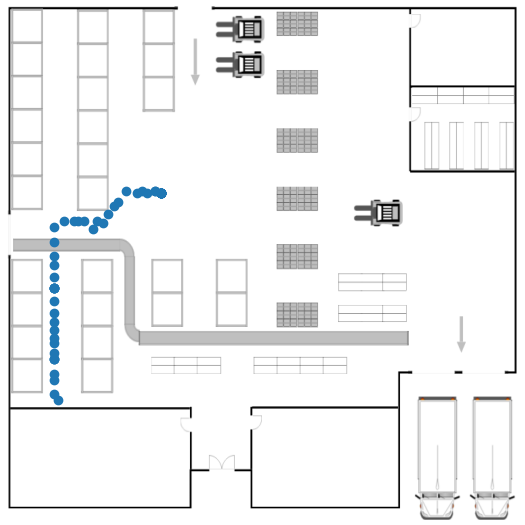
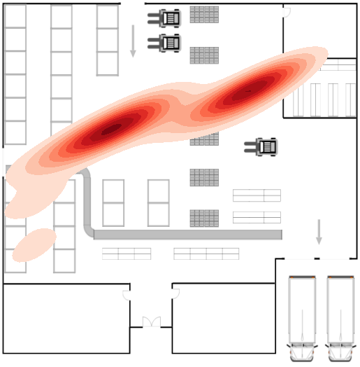

# README

This repository is dedicated to the creation of trajectory history and density maps in generic floor plans, for academic or work purposes.
The idea is to use a plant as a background image and put the historical data on top.

## Requirements

Libraries ```matplotib```, ```numpy```, ```scipy```, ```seaborn``` and ```pandas``` are necessary.
```
$ pip install matplotlib pandas numpy scipy seaborn
```

## Run

Running with this command will show the floorplan trajectory plot
```
$ python trajectory.py
```

After running a plot like this must be displayed:



Running with this command will show the density map plot
```
$ python densitymap.py
```

After running a plot like this must be displayed:


